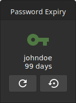

# LDAP Password Expiry Desklet for the Cinnamon Desktop


This desklet shows when your LDAP domain password expires. Additionally, you can change it directly with a click on the desklet.

It currently only supports the Microsoft Active Directory LDAP server. Feedback & contributions welcome!

This desklet is currenty in BETA phase and therefore not yet in the official cinnamon spices repo.

## 1. Installation
### Debian Package Installation (Debian/Ubuntu/Mint)
1. Download and install the `.deb` package from the [latest release](https://github.com/schorschii/ldappwd-desklet/releases) on Github.
2. Right click on your cinnamon desktop and add the desklet to your desktop. Continue with "**2. Desklet Setup**".

### Manual Installation
1. Copy `ldappwd@schorschii` directory into `~/.local/share/cinnamon/desklets` or `/usr/share/cinnamon/desklets`
2. Install the required packages
   (important: please install the newest `ldap3` from `pip`; version 2.4.1 from the Ubuntu 20.04 repo is not working)
   ```
   apt install python3-pip python3-gssapi zenity
   pip3 install ldap3
   ```
3. (optional) Install translation files
   ```
   cd ~/.local/share/cinnamon/desklets/ldappwd@schorschii
   cinnamon-json-makepot --install
   ```

## 2. Desklet Setup
1. Open the Cinnamon desklet manager and add the desklet to your desktop. Right click on it and open the desklet settings. It tries to automatically find out the correct values. Check and correct them if necessary.  

   **Example Values**  
   LDAP Server Address: `ldap://192.168.56.101` or `ldaps://dc1.example.com`  
   Username: `johndoe`  
   Domain: `example.com`  
   Disable Kerberos authentication if you are not using Kerberos. The desklet will then ask for password when clicking on the refresh button.  

   **Important**  
   - The server FQDN (full qualified domain name) is required as server address/URL if you want to use Kerberos authentication (the IP address will not work in this case).
   - SSL (`ldaps://`) (and therefore a valid server certificate) is required if you want to use the password change feature. A Windows Server will refuse password change over a non-secure `ldap://` connection.

2. Click the "Refresh" Button on the desklet and enter the password for the LDAP bind user to authenticate against the LDAP server.  

   If everything was entered correct, the desklet now displays when the password of the given user expires.

3. You can click the "Set New Password" button on the desklet to change your password directly.
